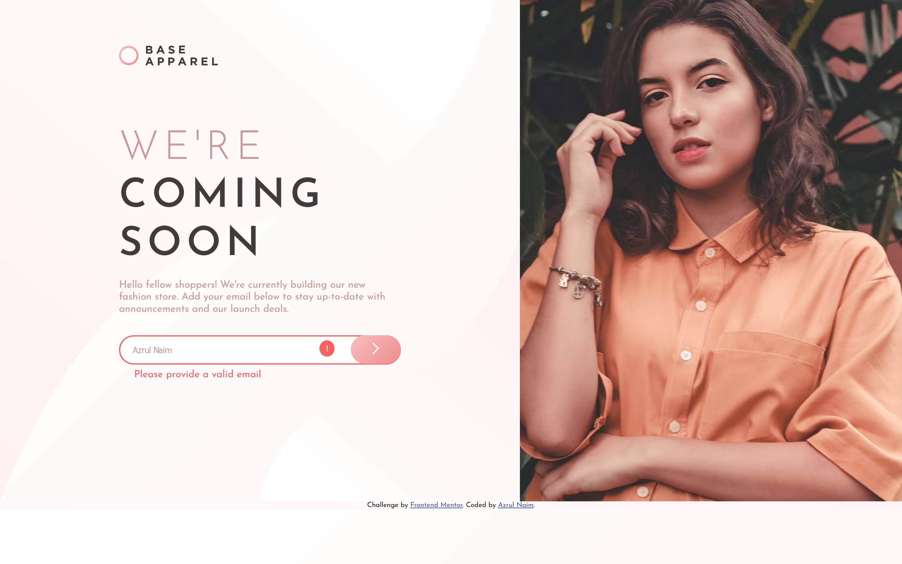

# Frontend Mentor - Base Apparel coming soon page solution

This is a solution to the [Base Apparel coming soon page challenge on Frontend Mentor](https://www.frontendmentor.io/challenges/base-apparel-coming-soon-page-5d46b47f8db8a7063f9331a0). Frontend Mentor challenges help you improve your coding skills by building realistic projects. 

## Table of contents

- [Overview](#overview)
  - [The challenge](#the-challenge)
  - [Screenshot](#screenshot))
- [My process](#my-process)
  - [Built with](#built-with)
  - [What I learned](#what-i-learned)
  - [Continued development](#continued-development)
  - [Useful resources](#useful-resources)
- [Author](#author)


## Overview

### The challenge

Users should be able to:

- View the optimal layout for the site depending on their device's screen size
- See hover states for all interactive elements on the page
- Receive an error message when the `form` is submitted if:
  - The `input` field is empty
  - The email address is not formatted correctly

### Screenshot




## My process

### Built with

- Semantic HTML5 markup
- CSS custom properties
- Flexbox
- CSS Grid
- Mobile-first workflow


### What I learned

```js
    // CUSTOM INPUT VALIDITY 
const inpEmail = document.querySelector("#email");
const cValid = document.querySelector("#c-valid");

function submitBtn() {
    if (!inpEmail.checkValidity()) {
        cValid.innerText = "Please provide a valid email"
        popUpMsg();
        warningMark();
    }
}
```


### Continued development

Still learning javascript


### Useful resources

- [Add/remove a predetermined class](https://stackoverflow.com/a/21709814/17908941) - This helped me for manipulating css pseudo-element.


## Author

- Website - [Azrul Naim](https://sjtape.github.io/)
- Frontend Mentor - [@sjtape](https://www.frontendmentor.io/profile/sjtape)
- Twitter - [@solitaryjester](https://twitter.com/solitaryjester)
- Facebook - [Azrul Naim](https://www.facebook.com/solitary69jester)
- Youtube - [Solitary Jester](https://www.youtube.com/channel/UCkoYmybPTWO92AnRl-q3hig)
